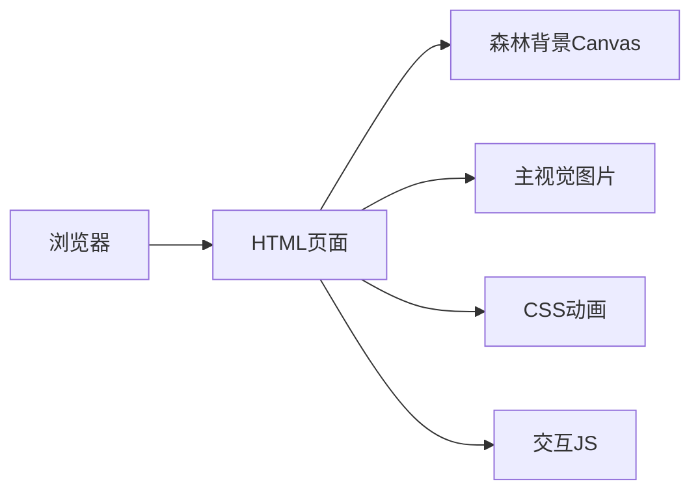

# 藿藿秘境 · Forest Dream - 项目白皮书

## 1. 项目概述

### 1.1 项目背景

**藿藿秘境**是一个以森林梦幻为主题的交互展示网站，融合了现代前端技术与艺术视觉设计，为用户提供沉浸式的浏览体验。

### 1.2 项目定位

- **类型**: 单页交互展示网站
- **主题**: 森林梦幻 / 自然治愈
- **核心价值**: 通过视觉美学与交互体验传递自然治愈的理念

### 1.3 目标用户

- 个人网站访客
- 社交媒体关注者
- 潜在合作伙伴

---

## 2. 技术架构

### 2.1 架构设计



### 2.2 技术栈

| 类别 | 技术 | 版本 | 说明 |
|------|------|------|------|
| 前端框架 | 纯 HTML5 | - | 单文件实现，无框架依赖 |
| 样式引擎 | TailwindCSS | 3.x | 通过 CDN 引入 |
| 自定义样式 | CSS3 | - | 动画、特效、玻璃拟态 |
| 图标库 | Font Awesome | 6.4.0 | 通过 CDN 引入 |
| 字体 | Google Fonts | - | Noto Serif SC + Noto Sans SC |
| 粒子效果 | Canvas API | - | 原生 JavaScript 实现 |

### 2.3 项目特点

- **零依赖**: 无需安装 Node.js 或任何依赖包
- **单文件**: 所有代码集中在一个 HTML 文件中
- **CDN 加载**: 外部资源通过 CDN 快速加载
- **响应式设计**: 适配桌面端和移动端

---

## 3. 页面结构

```
index.html
├── <head>
│   ├── TailwindCSS CDN
│   ├── Google Fonts
│   ├── Font Awesome
│   └── 自定义样式
├── <body>
│   ├── 光斑粒子背景 (Canvas)
│   ├── 装饰树叶 (CSS伪元素/SVG)
│   ├── 导航栏 (nav)
│   ├── Hero 区域 (section)
│   │   ├── 主视觉图片 + 光晕
│   │   ├── 标题文案
│   │   └── 行动按钮
│   ├── 特色内容区 (section)
│   │   └── 特色卡片 × 3
│   └── 页脚 (footer)
│   └── 交互脚本
```

---

## 4. 核心模块

### 4.1 森林背景模块

**功能描述**:
- 使用 Canvas 动态生成 80+ 光斑粒子
- 粒子具有随机大小、亮度、下落速度
- 实现缓慢飘落 + 左右摇摆动画
- 鼠标移动时产生视差效果

**技术实现**:
- 原生 Canvas API 绘制
- requestAnimationFrame 实现流畅动画
- 粒子类封装，支持碰撞检测和边界处理

### 4.2 主视觉图片模块

**功能描述**:
- 用户提供的角色图片作为核心视觉
- CSS box-shadow + 伪元素实现柔和光晕
- animation 实现缓慢漂浮和呼吸效果
- 鼠标跟随轻微位移

**技术实现**:
- CSS animation + @keyframes
- box-shadow 多层叠加
- JavaScript 监听鼠标事件实现跟随

### 4.3 导航模块

**功能描述**:
- 玻璃拟态 (backdrop-filter: blur)
- 滚动时添加阴影和背景增强
- 移动端汉堡菜单

**技术实现**:
- backdrop-filter: blur(10px)
- position: sticky 固定导航栏
- JavaScript 监听 scroll 事件

### 4.4 特色卡片模块

**功能描述**:
- 玻璃拟态风格卡片
- hover 时上浮 + 发光边框
- 图标 + 标题 + 描述结构

**技术实现**:
- CSS transition 实现平滑过渡
- hover 伪类触发效果
- Flexbox 布局

### 4.5 社交链接模块

**功能描述**:
- 支持多平台社交链接展示
- 当前包含：微信、微博、Instagram、GitHub
- 统一的图标样式和悬停效果

**技术实现**:
- Font Awesome 图标库
- CSS 圆形背景 + 悬停变色
- target="_blank" 新窗口打开

---

## 5. 视觉设计

### 5.1 色彩方案

| 颜色名称 | 颜色值 | 用途 |
|----------|--------|------|
| forest-dark | #0d1f0d | 最深层背景 |
| forest-mid | #1a3a1a | 中层背景 |
| forest-light | #2d5a2d | 浅层背景 |
| leaf-green | #7cb342 | 主色调 |
| soft-pink | #f8bbd9 | 点缀色 |
| cream | #f5f0e8 | 文字颜色 |
| glow-gold | #ffd54f | 光晕效果 |
| glow-green | #a5d6a7 | 绿色光晕 |

### 5.2 设计风格

- **玻璃拟态**: 半透明背景 + 模糊效果
- **自然主题**: 森林、树叶、光斑元素
- **柔和光影**: 渐变、光晕、阴影层次
- **流畅动画**: 平滑过渡、呼吸效果

---

## 6. 交互体验

### 6.1 鼠标交互

- 主视觉图片跟随鼠标轻微移动
- 背景粒子产生视差效果
- 卡片 hover 上浮 + 发光

### 6.2 滚动交互

- 导航栏背景渐变加深
- 内容区域淡入动画
- 平滑滚动到锚点

### 6.3 响应式交互

- 移动端汉堡菜单展开/收起
- 卡片自适应布局
- 图片响应式缩放

---

## 7. 文件结构

```
/Users/bytedance/claw/
├── index.html              # 主页面（包含所有代码）
├── image/
│   └── 20260629-181439.png  # 主视觉图片
├── public/
│   └── favicon.svg         # 网站图标
└── .gitignore              # Git 忽略配置
```

---

## 8. 部署说明

### 8.1 部署环境

- **Web 服务器**: Nginx / Apache
- **操作系统**: Linux (Ubuntu / CentOS)
- **端口**: 80 (HTTP) / 443 (HTTPS)

### 8.2 部署方式

1. 将 `index.html` 复制到网站根目录
2. 将 `image/` 和 `public/` 目录复制到网站根目录
3. 配置 Nginx 或 Apache 指向该目录

详细部署步骤请参考部署指南文档。

---

## 9. 维护与扩展

### 9.1 内容修改

- **修改标题/文案**: 编辑 `index.html` 中的文本内容
- **修改图片**: 替换 `image/` 目录下的图片文件
- **修改社交链接**: 编辑 `index.html` 中的 `<a>` 标签 href 属性

### 9.2 功能扩展

- 添加新页面：创建新的 HTML 文件
- 添加新模块：在 `index.html` 中添加新的 section
- 修改样式：编辑 `<style>` 标签内的 CSS

---

## 10. 总结

**藿藿秘境**项目是一个技术简洁、视觉精美、交互流畅的单页展示网站。通过纯 HTML + CSS + JavaScript 实现，无需复杂的构建工具和依赖管理，易于部署和维护。项目融合了现代前端技术与自然美学，为用户提供沉浸式的浏览体验。